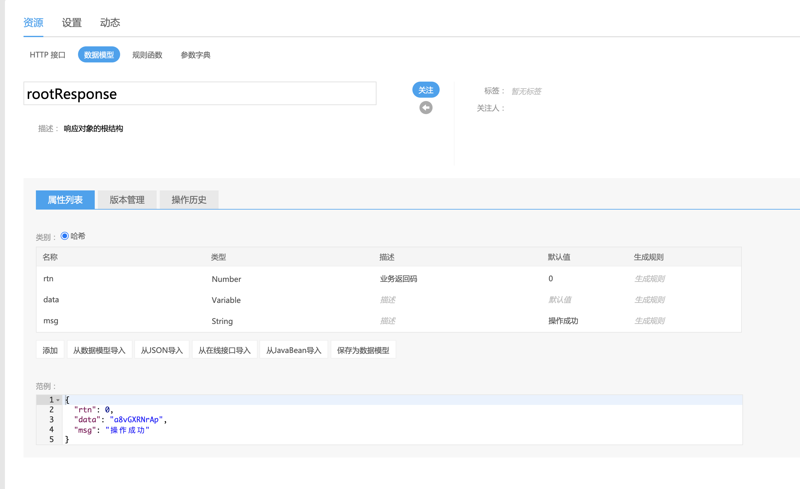

> 作者：王小英
>
> 日期：2020年6月15日

分析 NEI 的动机：团队在长期使用 YApi 后，发现 YApi 有诸多方面的不足，比如缺失最重要的数据模型功能。没有这个功能，就会导致一旦改变了某个字段名，就需要在多个接口中同时做修改，这在实际开发迭代中非常耗时。这种重复无意义的工作如果能通过更好用的接口管理平台来消除掉那再好不过啦。

# 简介

NEI 是一款由网易打造的于 2020 年 4 月 1 号正式开源的一款接口管理平台，此项目最初为网易内部使用，在功能逐渐趋于完善稳定后决定开源出来。贴一段官方公布的数据：

> 截止目前（2020 年 4 月 1 号），NEI 的注册用户超过 2 万 2 千（包括网易公司内部用户以及外部公司用户），接口数量超过 23 万，数据模型数量超过 28 万，内部产品（NEI 接口数量超过 100 的项目组）有 140 个之多，外部产品有 270 个之多

以下引自官方介绍文档：

NEI 按项目来管理所有资源，资源的创建和维护可由团队成员协作完成，目前它已经提供了以下功能：

- 项目管理：动态、团队管理、权限管理、项目文档等
- 页面管理：项目中的页面定义
- 异步接口：即本文所说的 API，可以定义请求头、请求数据、发送规则、响应头、响应结果、接收规则等
- 接口测试和用例管理：方便回归测试和生成测试代码
- 数据模型：NEI 中最强大的功能之一，对应数据库中的实体对象
- 页面模板：NEI 配套的[构建工具](https://link.zhihu.com/?target=https%3A//github.com/NEYouFan/nei-toolkit)会根据定义生成模板文件
- 规则函数：自定义 MOCK 数据，NEI 也预置了常见的规则函数
- 业务分组：按照业务对项目资源进行细分，方便管理
- 工程规范：本身可以当作脚手架，也可以和 NEI 项目结合，集成项目中的 API 和数据模型
- 消息中心：保证重要的操作能及时通知到相关负责人

# YApi 与 NEI 功能点对比

| 功能         | YApi | NEI  |
| ------------ | ---- | ---- |
| 项目管理     | ✔️    | ✔️    |
| 接口管理     | ✔️    | ✔️    |
| 角色管理     | ✔️    | ✔️    |
| 分组功能     | ✔️    | ✔️    |
| 标签功能     | ✔️    | ✔️    |
| 接口版本     | ✖️    | ✔️    |
| 生成接口文档 | ✖️    | ✔️    |
| 接口测试     | ✔️    | ✔️    |
| 自定义 Mock  | ✔️    | ✔️    |
| 自定义规则   | ✖️    | ✔️    |
| json 导入    | ✔️    | ✔️    |
| 接口审核     | ✖️    | ✔️    |
| 接口操作历史 | ✔️    | ✔️    |
| 数据模型     | ✔️    | ✔️    |
| 公共资源库   | ✖️    | ✔️    |
| 一键 CRUD    | ✖️    | ✔️    |
| RPC 接口     | ✖️    | ✔️    |
| 私有化部署   | ✔️    | ✔️    |

# 总结

经过上面的功能点对比，能总结一点： YApi 有的，NEI  都有，且在 saas 项目两周多的实践中使用数据模型确实帮助开发者节省了不少时间。因此在超猩项目中推广使用是可行的。但仍需要客观的面对它目前的缺点：

1. 界面、操作体验不如 YApi
2. 一些不影响主流程的小 bug，例如接口测试里必填字段与数据模型隐藏字段的优先级问题
3. 进阶使用的上手难度更高。例如 NEI 有不常见的 MockStore 新概念，已经学习如何自定义规则
4. NEI 使用的技术栈并非超猩前端 er熟知的，想定制化开发较 YApi(react+koa) 难度更大


附：

1. 超猩内网地址：http://nei.internal.supermonkey.com.cn/
2. 官方 github:  https://github.com/x-orpheus/nei-toolkit


# 操作教程

建议先看完 NEI 官方出的 16 分钟介绍视频 地址：https://nei.netease.com/tutorial

## 定义接口

### 数据模型

数据模型是 NEI 最强大的功能之一。

在 NEI 中有”公共资源库“的概念，代表同一个项目组下的项目都可使用在公共资源库定义的接口、数据模型。

我们可以将项目按模块划分然后定义成数据模型，例如：User 模块

```typescript
interface User {
  username: string;
  sex: string;
  age: number;
  height: number;
  phonenumber: number;
}
```

当创建创建用户(post)、获取用户信息(get)、修改用户信息(put) 等接口时，可重复引用上面的`User`模型，不需要增加一个`User`相关接口就重复手打上面的`User`字段，并且定义模型后也很方便以后假如`User`方式变化能统一修改。在实际场景中，这将大大节省前端接口定义的时间。

定义数据模型截图：

> 注意：如果在定义模型时无法确定该字段的类型，可将其设置为 `Variable`类型，例如下图中的 `data` 字段，在引用该模型时可改为你需要的类型。



### 规则函数

为方便处理相同的逻辑, 在 NEI 平台上可以创建规则函数, 用户可以自己编写 JavaScript 脚本来处理数据。目前有三类规则函数: 生成规则、发送规则、接收规则。

#### 生成规则

指的是 mock 数据的生成规则, 用户可以编写 JavaScript 脚本来生成自定义的 mock 数据。

在生成规则的函数内部，可以通过 `this.param` 获取到当前参数的内容，可以通过 `this.ds` 获取所有的数据模型列表。

> 提示: 目前 NEI 系统已经内置了 10 个规则函数方便用户调用, 具体请查看: [NEI平台系统预置的规则函数集](https://github.com/x-orpheus/nei-toolkit/blob/master/doc/NEI平台系统预置的规则函数集.md)

> 注意: NEI 系统内置的方法通过 `NEI.[方法名]` 的形式调用, 比如 `NEI.chinese(15)`, 用户自定义的规则函数直接调用, 比如用户定义了一个叫 `RandomPrizeType` 的规则函数, 则可以直接调用 `RandomPrizeType()`

#### 发送规则

在测试异步接口时, 有时在发送数据之前可能想对数据再进行一层处理, 此时可以使用发送规则的功能。

NEI 平台在调用发送规则时, 会传入一个参数对象, 然后是用户传入的参数。

第一个系统传入的对象包含以下 4 个字段:

```json
{
    "host": "接口的服务器地址",
    "path": "接口的相对路径",
    "method": "接口的请求方法",
    "headers": "请求头参数, 是一个键值对列表对象",
    "data": "请求的 mock 数据"
}
```

**发送规则须返回一个对象**, 并且该对象也包含上述 5 个字段, 测试接口时真正发送的数据是返回对象中的相应数据。

例子：一个简单的发送规则函数

```js
function beforeSend() {
  const param = arguments[0];
  const myData = arguments[1];
  console.log(Object.assign(param, {data: Object.assign(param.data, myData)}));
  return Object.assign(param, {data: Object.assign(param.data, myData)});
}
```

```js
// 调用
beforeSend({a: 1})
```

#### 接收规则

在测试异步接口时, 有时在接收数据之前可能想对数据再进行一层处理, 此时可以使用接收规则的功能。

NEI 平台在调用接收规则时, 会传入一个参数对象, 然后是用户传入的参数。

第一个系统传入的对象包含以下 4 个字段:

```json
{
    "host": "接口的服务器地址",
    "path": "接口的相对路径",
    "method": "接口的请求方法",
    "headers": "服务器返回的响应头参数, 是一个键值对列表对象",
    "data": "服务器返回的响应数据"
}
```

**接收规则须返回一个对象**, 并且该对象也包含上述 5 个字段, 在验证接口的响应时, 使用的是返回对象中的相应数据。

```js
function afterReceived() {
  const param = arguments[0];
  const myData = arguments[1];
  console.log(Object.assign(param, {data: Object.assign(param.data, myData)}));
  return Object.assign(param, {data: Object.assign(param.data, myData)});
}
```

```js
// 调用
afterReceived({a: 1})
```

## 接口测试

NEI 上的接口测试应当由后端开发人员来完成，完整流程是：

前端定义接口 => 后端审核 => 后端开发接口|前端使用 Mock 数据开发需求 => 后端使用 NEI 接口测试 => 测试通过，正式交付接口 => 前端联调测试环境接口


# 数据迁移

YApi => NEI 正在编写中...

Github 私有仓库：https://github.com/lilywang711/yapi-to-nei