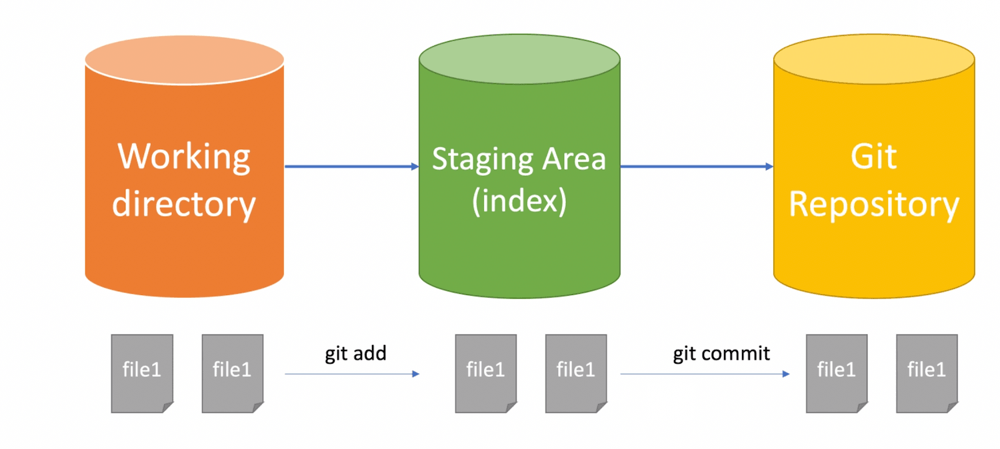
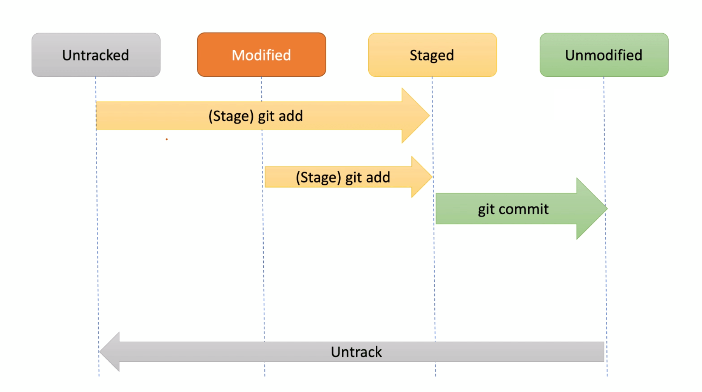

# 深入了解 Git 用法-第一周

> 小英

- git 基础
- git clone
- git add
- git commit

> 冬林

- git status
- git checkout
- git reset 

## git 的三个区域

- 工作区：电脑里能直接看到的文件目录、项目文件夹
- 暂存区(索引区)：保存了下次要提交到仓库的内容，在 `.git/index` 文件中能够看出
- 本地仓库: `.git`目录

## 文件的四个状态



Untracked: 在工作区刚新建的文件，还没有纳入 git 管理范围

UnModified: 本地 xx 文件与上一次提交相比没有任何变化（也就是 committed 后的文件）

Modified: 已经 committed 的文件，通过 vi/编辑器修改后，就变成 Modified

Staged: git add 后进去暂存区的文件

## HEAD

head 是一个指针，默认指向当前所在的分支，可以通过这个命令来查看

```bash
$ cat ~/.git/HEAD
ref: refs/heads/master # 代表当前 HEAD 指向 master 分支，当使用 git checkout develop 后，便会指向 develop 分支

```

它有两个特性：1、默认指向当前所在的分支 2、指向当前所在分支的最近一次提交。

但 `HEAD` 可以指向任何一个 commit，当`HEAD`不指向分支的最近一次提交时，它就变成了`detached HEAD`（分离状态）。

当`HEAD`处于分离状态（不依附于任一分支）时，提交操作可以正常进行，但是不会更新任何已命名的分支。(你可以认为这是在更新一个匿名分支)

## git add

将工作区的变更提交到暂存区

##### 基本用法

```bash
$ git add <path> <path>
$ git add . # 将工作区所有的变动都提交到暂存区
```

##### 进阶：当执行 git add 后发生了什么？

【屏幕演示】

```bash
$ mkdir git-test && cd git-test && git init
$ tree .git -I 'hooks' # 查看 .git 目录结构
.git
├── HEAD
├── branches
├── config
├── description
├── info
│   └── exclude
├── objects
│   ├── info
│   └── pack
└── refs
    ├── heads
    └── tags

8 directories, 4 files

$ echo hello world>hello.txt
$ git add hello.txt
$ tree .git -I 'hooks' # 再次查看.git 目录结构，发现多了一个 3b 文件夹，多了 index 和 18e5*** 两个文件
.git
├── HEAD
├── branches
├── config
├── description
├── index
├── info
│   └── exclude
├── objects
│   ├── 3b
│   │   └── 18e512dba79e4c8300dd08aeb37f8e728b8dad
│   ├── info
│   └── pack
└── refs
    ├── heads
    └── tags

9 directories, 6 files

$ git cat-file -t 3b18e5 # 参数 -t 查看这个 object 的类型(ps: git object 有四种类型 tree blob tag commit)
blob
$ git cat-file -p 3b18e5 # 参数 -p 查看这个 object 的内容
hello world
$ git cat-file -s 3b18e5 # 参数 -s 查看这个 object 的大小
12 # 说明有 12 字节 即 hello空格world+echo 输入末尾自带的空格符
```

也就是说当敲下 `git add `后，git 在 `.git/objects`下生成了一个文件，这个文件是通过一个散列(哈希)算法 SHA1 生成的，生成步骤如下：

```bash
$ echo "blob 12\0hello world" | shasum
3b18e512dba79e4c8300dd08aeb37f8e728b8dad
```

> shasum 是 Mac 里自带的命令工具，计算哈希值，默认是 SHA1 算法

也就是得到了和上面`.git/object`下一样的哈希值！✿✿ヽ(°▽°)ノ✿

现在有木有很好奇 `.git/objects/3b/18e512dba79e4c8300dd08aeb37f8e728b8dad`这个文件里到底装的是什么呢？我们用 `cat `命令瞧一瞧

```bash
$ cat .git/objects/3b/18e512dba79e4c8300dd08aeb37f8e728b8dad
xK��OR04b�H���W(�/�I�D� # 咦 怎么看起来像是乱码 😮
```

综上使用`git add`将文件存进暂存区后，git 会将该文件的内容通过压缩存进 git 数据库中。至于如何解压乱码得到原始内容请自行搜索(tip: keyword zlib)~

## git commit

将暂存区的 commits 提交到 git 仓库

##### 基本用法

```bash
$ git commit -m "your message" # 提交信息
$ git commit -am "your message" # git add + git commit
$ git commit --amend # 修改上次提交的 message，会使用与上次提交节点相同的父节点进行一次新的提交，旧的提交将会被取消
```

##### 进阶：当执行 git commit 后发生了什么？

继续敲命令：

```bash
$ git commit -m "add hello.txt"
[master (root-commit) 4b609da] add hello.txt
 1 file changed, 1 insertion(+)
 create mode 100644 hello.txt
 
$ git cat-file -t 4b609da
commit # 得到 commit 类型
$ git cat-file -p 4b609da # 查看这个 commit 的内容
tree 68aba62e560c0ebc3396e8ae9335232cd93a3f60 # 得到一个 tree 类型
author lilywang <lilywang.cd@gmail.com> 1593706460 +0800
committer lilywang <lilywang.cd@gmail.com> 1593706460 +0800

add hello.txt
$ git cat-file -t  68aba62 # 查看上面 tree 的类型
tree
$ git cat-file -p  68aba62 # 查看上面 tree 的内容
100644 blob 3b18e512dba79e4c8300dd08aeb37f8e728b8dad	hello.txt
# 解读结果
# 100644：100 代表 regular file，644 代表文件权限；
# block: 为 blob 类型，即文件类型
# 3b18e512dba79e4c8300dd08aeb37f8e728b8dad： 是不是很熟悉？指向刚刚 git add 后生成的那个哈希值
# hello.txt 文件名
```

再次查看 `.git/object`的结构，从一个变成了三个

```bash
$ tree .git/object
├── objects
│   ├── 3b
│   │   └── 18e512dba79e4c8300dd08aeb37f8e728b8dad # 储存着 hello.txt 文件内容,为 blob 类型
│   ├── 4b
│   │   └── 609daad37ebbaec7ba9c7ef6634d5e51fc123b # 储存着本次 commit 的内容
│   ├── 68
│   │   └── aba62e560c0ebc3396e8ae9335232cd93a3f60 # 储存着本次 commit 下 tree 的内容
│   ├── info
│   └── pack

```

这三个类型的关系是：commit > tree > blob，如下图所示


## git clone

将仓库克隆到新目录中（从远端到本地、从本地到本地）

##### 基本用法

```bash
$ git clone <repo> <local path>
$ git clone --branch <tag/branch> <repo> # 克隆指定标签、分支
$ git clone --depth=1 <repo> # 只克隆最后一次提交，有效提升 clone 速度和减少占磁盘大小
```

## git status

- git status 查看当前仓库文件状态
  ```bash
  $ git status
  ```
  输出
  ```
  On branch zdl
  Changes to be committed:
  (use "git reset HEAD <file>..." to unstage)

        modified:   README.md
        new file:   第一周.md
  ```

## git checkout

  git checkout 检出分支 和 文件
```bash
$ git checkout README.md 将 README.md 检出到未修改的状态
$ git checkout . 将所有有修改的文件 检出为 未修改的状态
```

检出分支的操作下周再讲。

## git reset
```bash
$ git reset # 重置操作
$ git reset --soft commitId
$ git reset --mixed # (git reset 的默认行为)
$ git reset --hard HEAD~n


- HEAD~n: # 指的是 HEAD 所指的前 n 个提交。
- HEAD^: # 指的是 HEAD 所指的前 1 个提交。
- HEAD^^: # 指的是 HEAD 所指的前 2 个提交。
```
demo: 假如现在的历史看起来像是这样的：


我们看看 reset 做了什么

##### 第 1 步：移动 HEAD
```reset``` 做的第一件事是移动 HEAD 的指向, ```reset  ```
移动 HEAD 指向的分支。
这意味着如果 HEAD 设置为 master 分支（例如，你正在 ```master``` 分支上）， 运行 ```git reset 9e5e6a4``` 将会使 ```master``` 指向 9e5e6a4。


无论你调用了何种形式的带有一个提交的 ```reset```，它首先都会尝试这样做。 使用 ```reset --soft```，它将仅仅停在那儿。
整个流程终止。

理解一下发生的事情：它本质上是撤销了上一次 git commit 命令。 当你在运行 git commit 时，Git 会创建一个新的提交，并移动 HEAD 所指向的分支来使其指向该提交。 当你将它 reset 回 HEAD~（HEAD 的父结点）时，其实就是把该分支移动回原来的位置，而不会改变索引和工作目录。

##### 第 2 步：更新索引（--mixed）

如果指定 ```--mixed``` 选项，```reset``` 将会在这时停止。 这也是默认行为，所以如果没有指定任何选项（在本例中只是 ```git reset HEAD~```），这就是命令将会停止的地方。

现在再看一眼上图，理解一下发生的事情：它依然会撤销一上次 提交，但还会 取消暂存 所有的东西。 于是，我们回滚到了所有 ```git add``` 和 ```git commit``` 的命令执行之前。


##### 第 3 步：更新工作目录（--hard）

```reset``` 要做的的第三件事情就是让工作目录看起来像索引。 如果使用 ```--hard``` 选项，它将会继续这一步。


> 必须注意，```--hard``` 标记是 reset 命令唯一的危险用法，它也是 Git 会真正地销毁数据的仅有的几个操作之一。 其他任何形式的 reset 调用都可以轻松撤消，但是 ```--hard```选项不能，因为它强制覆盖了工作目录中的文件。 在这种特殊情况下，我们的 Git 数据库中的一个提交内还留有该文件的 v3 版本， 我们可以通过 ```reflog``` 来找回它。但是若该文件还未提交，Git 仍会覆盖它从而导致无法恢复。

#### 回顾：
```reset``` 命令会以特定的顺序重写三个工作区，在你指定以下选项时停止：

 1、移动 HEAD 分支的指向 （若指定了 ```--soft```，则到此停止）
 2、使索引看起来像 HEAD （若未指定 ```--hard```，则到此停止）
 3、使工作目录看起来像索引


##### 通过路径来重置

若指定了一个路径，```reset``` 将会跳过第 1 步，并且将它的作用范围限定为指定的文件或文件集合。 这样做自然有它的道理，因为 ```HEAD``` 只是一个指针，你无法让它同时指向两个提交中各自的一部分。 不过索引和工作目录 可以部分更新，所以重置会继续进行第 2、3 步。


假如我们运行 ```git reset file.txt``` （这其实是 ```git reset --mixed HEAD file.txt ```的简写形式，因为你既没有指定一个提交的 SHA-1 或分支，也没有指定  ```--soft``` 或 ```--hard```），它会：

1、移动 HEAD 分支的指向 （已跳过）
2、让索引看起来像 HEAD （到此处停止）

所以它本质上只是将 file.txt 从 HEAD 复制到索引中。


这种操作下，它具有 取消暂存文件 的实际效果。 


我们可以不让 Git 从 HEAD 拉取数据，而是通过具体指定一个提交来拉取该文件的对应版本。 我们只需运行类似于  ```git reset eb43bf file.txt``` 的命令即可。


#### git checkout [branch]  和 git reset --hard [branch] 的区别

1、checkout 对工作目录是安全的，它会通过检查来确保不会将已更改的文件弄丢。 其实它还更聪明一些。它会在工作目录中先试着简单合并一下，这样所有_还未修改过的_文件都会被更新。 而 ```reset --hard``` 则会不做检查就全面地替换所有东西。
2、第二个重要的区别是 checkout 如何**更新** HEAD。 reset 会**移动** HEAD 分支的指向，而 checkout 只会**移动 HEAD 自身**来指向另一个分支。

比如： 执行：
```bash
$ git checkout master
$ git reset master
```


应用场景：

#### 1、修改最后一次提交记录
```bash
$ git reset --soft HEAD^
$ git commit -m 'new commit message'
```
#### 2、利用 --mixed 来压缩提交
eg: 举例子


