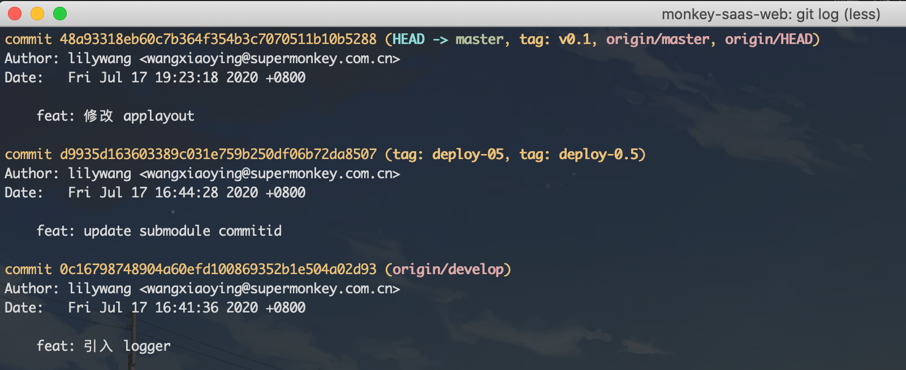
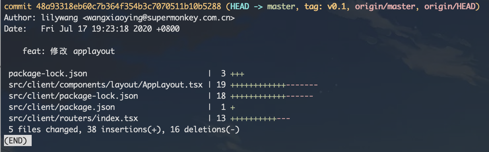
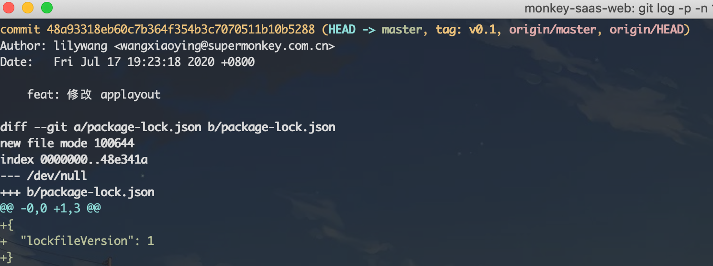
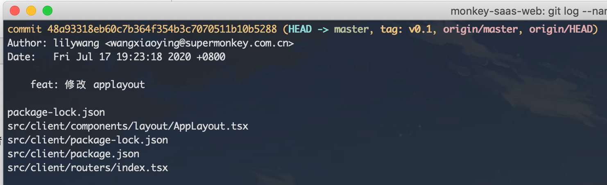
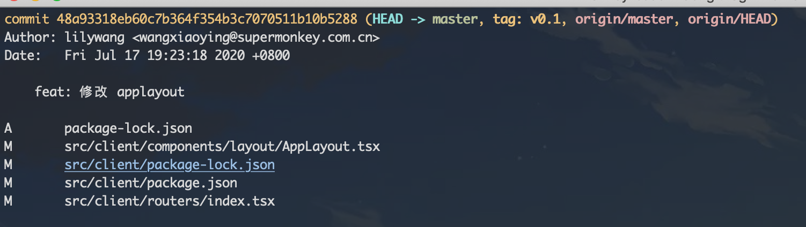
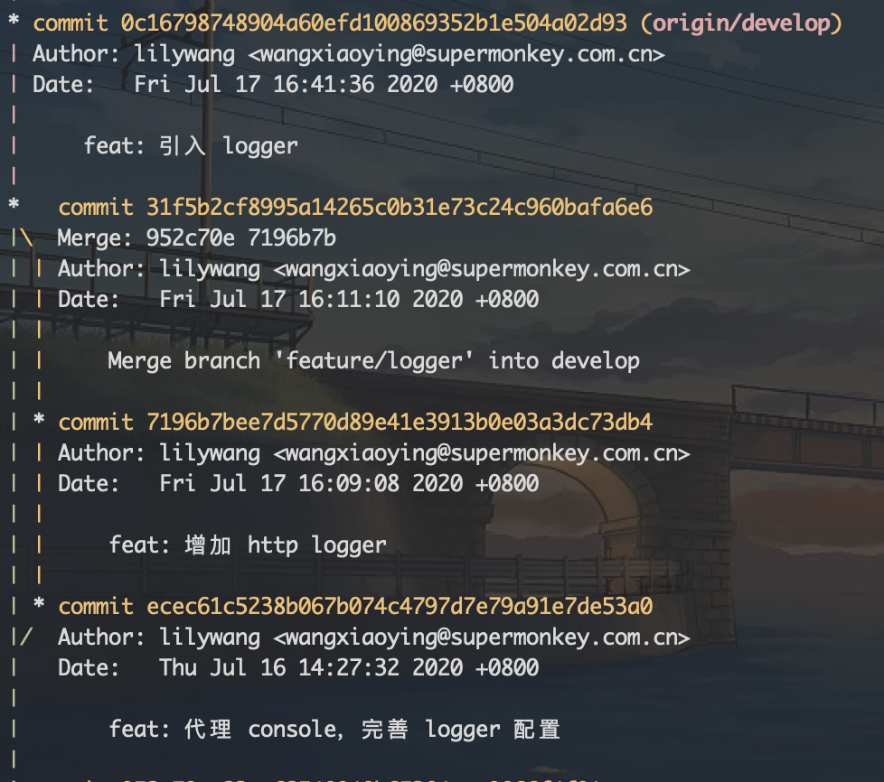
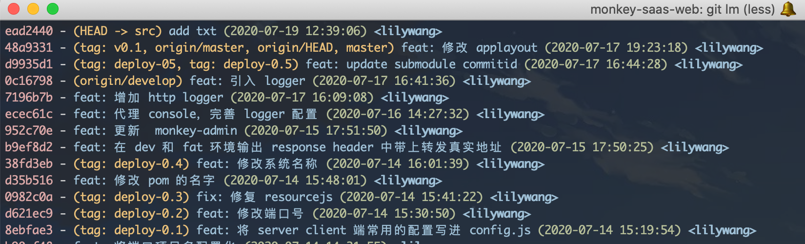
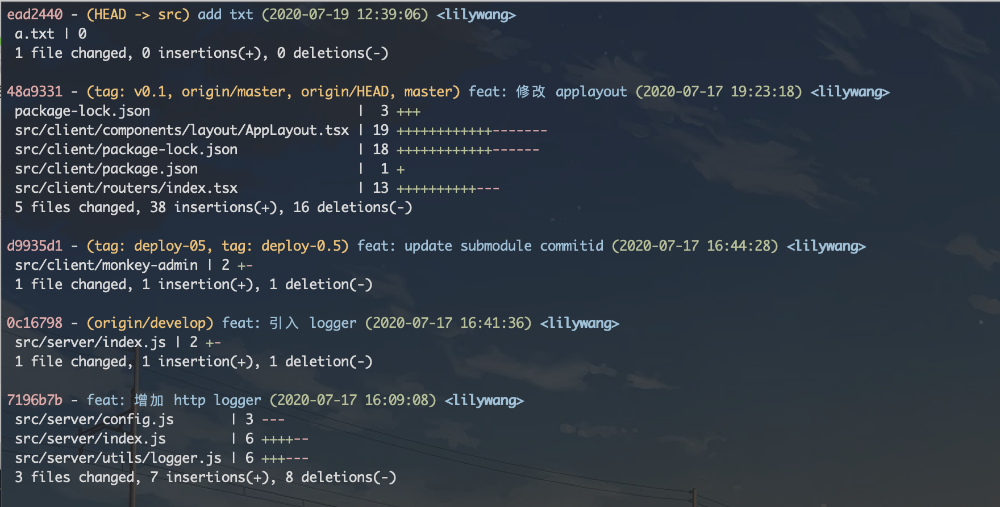
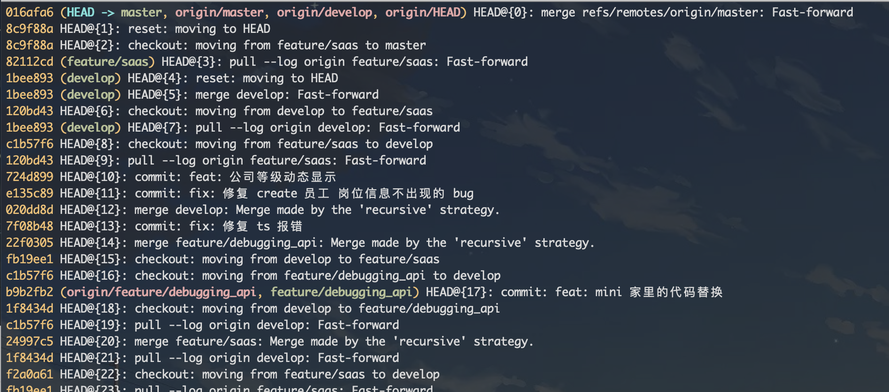

# 深入了解 Git 用法-第三周

> 小英

- git log
- git reflog
- git blame
- git remote

## git log

展示提交记录

官方提供了非常多的参数来花样展示记录，一大波参数即将来袭~

### 默认
#### git log

包含如下信息，(**notes**: `git log --help` PRETTY FORMATS 部分)

1. SHA1值
2. 作者昵称和邮箱
3. 提交时间
4. 提交信息
5. 各个分支指向、HEAD 指向、Tag 指向

### 

### 按提交信息

git log --grep="chore" 搜索含"chore"关键词的提交

### 按数量

#### git log -n {n}

指定显示多少条log 信息，例如 `git log -n 5` 显示 5 条

### 按时间

#### git log --after=

`git log --after="2020-7-1" --reverse` 显示 2020-7-1 之后的提交记录

#### git log --before=

`git log --before="2020-7-1" --reverse` 显示 2020-7-1 之前的提交记录

### 按作者

#### git log --author=

`git log --author="lilywang" ` 将只会显示 lilywang 的提交记录（模糊查找）

`git log --author="lilywang\|deepfunc"` 查看多人的 commit

`git log --author="lilywang.cd@gmail.com"` 还可以按邮箱来搜索

### 按文件

#### git log -- [file1]  [file2] [file3]

`git log -- src/client/package.json` 指定明确的路径

`git log -- src/client/package*.json` 也可用正则匹配

`--` 这个符号的作用是告诉 git 后面接的是文件路径而不是分支名，如果后面的路径和分支名不会产生混淆，你可以省略 `--`

### 按分支

#### git log [branchName] 

### 按范围

#### git log [since]..[until]

1. 这个命令非常有用当你使用 branch 做为 range 参数的时候. 能很方便的显示 2 个 branch 之间的不同

2. git log master..feature，master..feature 这个 range 包含了在 feature 有而在 master 没有的所有 commit，同样，如果是 feature..master 包含所有 master 有但是 feature 没有的 commit

### 按标签 Tag

1. `git log deploy-0.5` 查询标签之前的 commit，包含 `deploy-0.5`

2. `git log deploy-0.5..` 查询标签之后的 commit，不包含`deploy-0.5`

### 按 commit

#### git log --no-merges

默认情况下 git log 会输出 merge commit . 你可以通过 --no-merges 标记来过滤掉 merge commit

#### git log --merges

只会输出 merge 提交

#### git log [commit]

1. `git log commit1`查询 `commit1` 之前的记录，  包含 `commit1`
2. `git log commit1 commit2` 查询 `commit1` 与`commmit2`之间的记录，  包含 `commit1` `commit2` [commit1, commit2]
3. `git log commit1..commit2` 查询 `commit1` 与`commmit2`之间的记录， 不 包含 `commit1`  (commit1, commit2]

### 按输出格式

#### git log --stat

显示每次更新的修改文件的统计信息，每个提交都列出了修改过的文件，以及其中添加和移除的行数，并在最后列出所有增减行数小计

```bash
$ git log -n 1 --stat
```



#### git log --p

和上面的 `--stat`的区别就是 `-p`会详细的展示每个文件的每一行的前后差异



#### git log --name-only

显示有过任何改动的文件清单



#### git log --name-status

显示新增、修改和删除的文件清单



#### git log --oneline

一行展示，输出简洁，日常使用最频繁

```bash
$ git log --oneline
ead2440 (HEAD -> src) add txt
48a9331 (tag: v0.1, origin/master, origin/HEAD, master) feat: 修改 applayout
d9935d1 (tag: deploy-05, tag: deploy-0.5) feat: update submodule commitid
```

#### git log --graph

显示 ASCII 图形表示的分支合并历史



#### git log --pretty=

此参数虽强大但日常不怎么使用，可参考官方文档自行研究

以下是从网上找来已经写好的很强大的 log

```bash
# 1
$ git config --global alias.lm  "log --no-merges --color --date=format:'%Y-%m-%d %H:%M:%S' --author='lilywang\|wangxiaoying' --pretty=format:'%Cred%h%Creset -%C(yellow)%d%Cblue %s %Cgreen(%cd) %C(bold blue)<%an>%Creset' --abbrev-commit"
# 2
$ git config --global alias.lms  "log --no-merges --color --stat --date=format:'%Y-%m-%d %H:%M:%S' --author='lilywang\|wangxiaoying' --pretty=format:'%Cred%h%Creset -%C(yellow)%d%Cblue %s %Cgreen(%cd) %C(bold blue)<%an>%Creset' --abbrev-commit"

$ git log --format='%aN <%aE>' | sort -u | grep -v '<>'  # 罗列提交人
```

1 效果图



2 效果图



## git reflog

官方解释 “a log of where your HEAD and branch references have been for the last few months.”，也就是这个命令保存了 HEAD 指针的变化（**notes**: 哪些操作会导致 HEAD 指向的变化）

注意事项

1. 只记录 HEAD的变动，例如 git reset ,git commit，像 git checkout -- filename 这样的操作将不会记录
2. git reflog 的记录只会持续几个月，不会永远都在（默认是 90 天）
3. git reflog 只是记录了你本机自己的操作，所以无法恢复到别人的未提交的 commits

#### 基本使用

```bash
$ git reflog # 是 git reflog show HEAD 的缩写, 等同于 git log -g --abbrev-commit --pretty=oneline
$ git reflog show master # 查看 master 的 reflog
$ git reflog show stash # 查看 stash 的 reflog，git diff HEAD stash@{0} 查看当前与 stash{0} 的区别
$ git reflog show tag-0.1 # 查看标签的 reflog
$ git reflog delete HEAD@{n} # 删除 HEAD${n} 这条记录
$ git reflog show --date=iso # ${n}就会现成是时间格式，方便知道是几时几分几秒进行的操作
```

执行 git reflog 可以看到如下


### 场景

1. 误删掉了一个已经 commit 的文件 index.js

    恢复：git reflog + git reset --hard HEAD@{n}
    
2. 恢复一个删除的分支

    恢复：git checkout -b branchname HEAD@{n}

如何查看项目中的 **unreachable** 对象（commit tree blob）

```git fsck --unreachable```

只查看 **unreachable** commit 对象

`git fsck --unreachable | git cat-file --batch-check |   awk '/commit/ { print $3 }'`

`git log $(git fsck --unreachable | git cat-file --batch-check |   awk '/commit/ { print $3 }')`

清理 **unreachable**对象

`git gc`

## git blame

线上出 bug 了，想找出那段代码最后修改者是谁写？git blame 可以做到

#### 基本使用

```bash
$ git blame <filename>
$ git blame -L 100,100 <filename> # 第 100 行
$ git blame -L 100,+10 <filename> # 第 100~110 行
```

#### 延伸

由于 git blame 只能看到最近一次的修改者，但实际上我们常常需要知道某段代码的整个提交记录（因为 bug 或许并不是最近一次提交者写的）

方法是

```bash
$ git log -L start,end:file
$ git log -L 1,10:package.json
```

## git remote

#### 基本使用

```bash
$ git remote add <name> <url>  # 添加一个远程仓库
$ git remote rename <old> <new> # 重命名远程仓库别名
$ git remote remove <name> # 移除
$ git remote set-url <name> <newurl> [<oldurl>]
$ git remote prune origin # 删除掉本地缓存的在远端早已不存在的分支列表
$ git remote -v # 查看远端仓库列表
```

#### 延伸

1. origin 是什么？

   origin 只是远程仓库的一个别名而已，你可以将它改成任何单词。`git push origin branchname`可以换成 `git push git@github.com:git/git.git master`，用 origin 只是更方便了而已。

## 参考资料

1. [git log命令全解析，打log还能这么随心所欲！](https://www.cnblogs.com/bellkosmos/p/5923439.html)
2. [Git 基础 - 查看提交历史](https://git-scm.com/book/zh/v2/Git-%E5%9F%BA%E7%A1%80-%E6%9F%A5%E7%9C%8B%E6%8F%90%E4%BA%A4%E5%8E%86%E5%8F%B2)
3. [多个 parents 的 commit](https://softwareengineering.stackexchange.com/questions/314215/can-a-git-commit-have-more-than-2-parents)
4. [了解 git gc](https://www.atlassian.com/git/tutorials/git-gc)
5. [How long does git keep out-of-branch commits?](https://stackoverflow.com/questions/27397344/how-long-does-git-keep-out-of-branch-commits)

