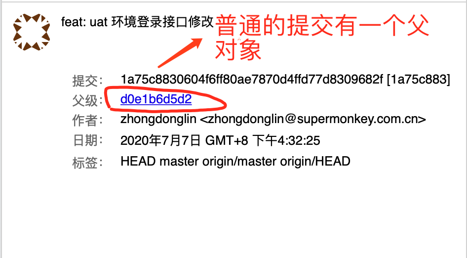
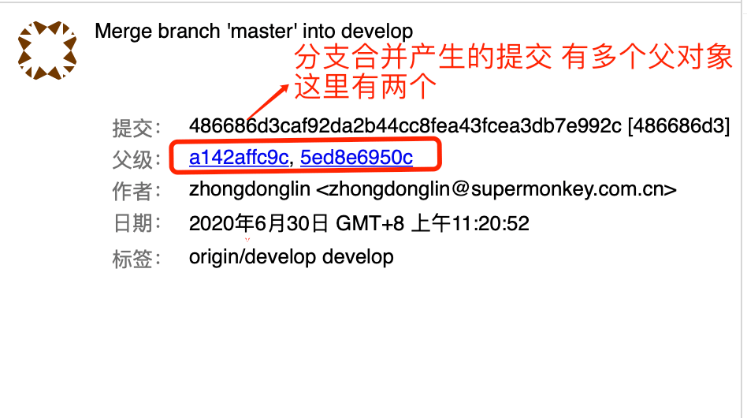
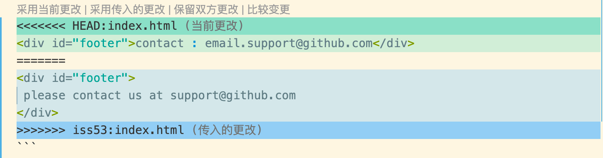
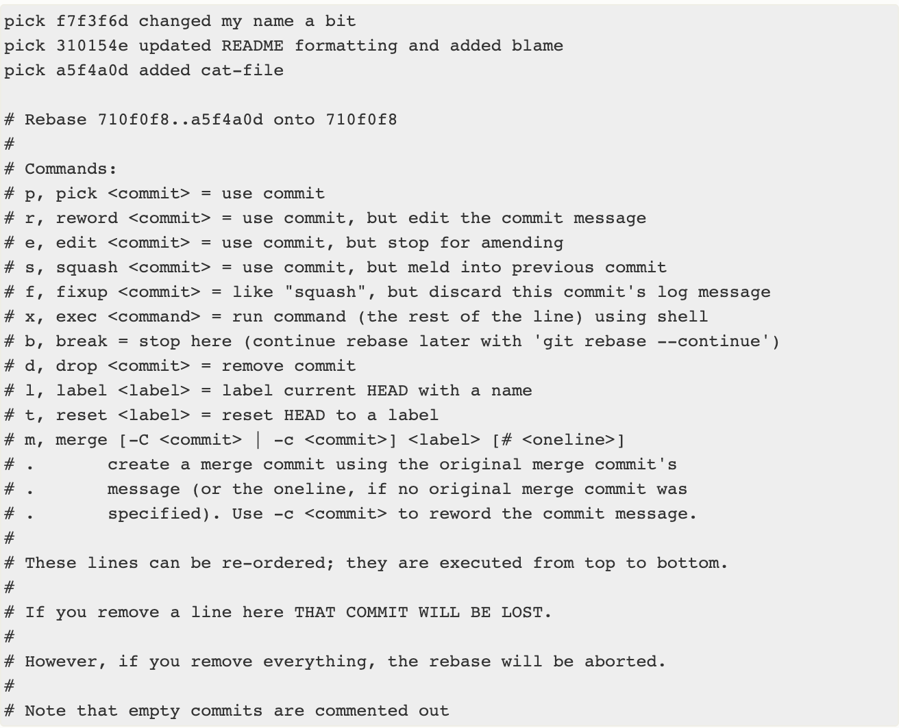

# 深入了解 Git 用法 - 第二周

> 冬林

- 分支介绍
- git checkout --branch
- git merge
- git rebase (包含 git rebase -i)

## Git moji 让每一次提交都充满活力:tada::tada::tada:

[gitmoji 官网](https://gitmoji.carloscuesta.me/)

## 分支基础知识

在进行提交操作时， Git 会保存一个提交对象（commit object）
一个提交信息包含以下内容：
- 作者的姓名和邮箱
- 提交时输入的信息（commit message）
- 指向它的父对象的指针（```首次提交产生的提交对象没有父对象，普通提交操作产生的提交对象有一个父对象， 而由多个分支合并产生的提交对象有多个父对象```）


普通的单次提交


由分支合并的产生提交对象多个父对象


我们假设现在有一个工作目录，里面包含了三个将要被暂存和提交的文件， 目录结构如下：

```bash
project
├── LICENSE
├── test.rb
└── README.md
```
如果我们执行下面的命令：
```bash
$ git add README.md test.rb LICENSE # 步骤 1
$ git commit -m 'The initial commit of my project' # 步骤 2
```
当执行 **步骤 1** 时:
暂存操作会为每一个文件计算校验和（使用 SHA-1 哈希算法），然后会把当前版本的文件快照保存到 Git 仓库中 （Git 使用 blob 对象来保存它们），最终将校验和加入到暂存区域等待提交

当执行 **步骤 2** 时:
用 ```git commit``` 进行提交操作时，Git 会先计算每一个子目录（本例中只有项目根目录）的校验和， 然后在 Git 仓库中这些校验和保存为树对象。随后，Git 便会创建一个提交对象， 它除了包含上面提到的那些信息外，还包含指向这个树对象（项目根目录）的指针。


当有几次提交后，提交对象之间的关系长这样:


> Git 的分支，其实本质上仅仅是指向提交对象的可变指针。 Git 鼓励在工作流程中频繁地使用分支与合并，哪怕一天之内进行许多次。

Note:
> Git 的 master 分支**并不是**一个特殊分支。 它就跟其它分支完全没有区别。 之所以几乎每一个仓库都有 master 分支，是因为 git init 命令默认创建它，并且大多数人都懒得去改动它。


## 分支操作
### 1、创建分支
```bash
$ git branch testing # 创建一个名字为 testing 的分支
```


Git 又是怎么知道当前在哪一个分支上呢？ 也很简单，它有一个名为 HEAD 的特殊指针
因为 ```git branch``` 命令仅仅 创建 一个新分支，并不会自动切换到新分支中去。


#### HEAD 的特性
 - HEAD 指向当前所在的分支
 ```bash
  $ git log --oneline --decorate # git log 命令查看各个分支当前所指的对象
 ```
 
 - HEAD 分支随着提交操作自动向前移动
 - 检出时 HEAD 随之移动
### 2、切换分支
```bash
$ git checkout testing # 这样 HEAD 就 指向 testing 分支了
# 此操作做了两件事情
# 一是使 HEAD 指回 testing 分支
# 二是将工作目录恢复成 testing 分支所指向的快照内容
```
执行 ```git checkout testing``` 之后，HEAD 的指向


> Tips: 创建并且切换到新分支: 通常我们会在创建一个新分支后立即切换过去  ``` git checkout -b branchName```

### 3、删除分支
```bash
$ git branch -d branchName # 删除本地分支，安全操作
$ git branch -D branchName # 强制本地删除分支, !!! 危险操作
```

### 4、清理分支:
删除远程分支时，有时会遇到问题，这个时候需要清理本地分支信息的缓存，执行： 
```bash
$ git fetch --prune origin
$ # 可以简写成 git fetch -p origin
```

### 4、合并分支
> 合并分支有 2 种方法：使用 merge 或 rebase

#### 使用 merge 合并

- ##### Fast-Forward 合并(快进合并)

假设 目前的分支情况是这样的：我们在 hotifx 分支里 修复了一个 bug, 并且提交了一次


此时，我们要把 修复的 bug 上线，这个时候，我们就需要 把 hotfix 合并到 master 分支上.

```bash
$ git checkout master
$ git merge hotfix
```

然后，分支的情况就变成这样子了


- ##### 三方合并(基本合并)

三方合并栗子：
假设 此时的分支是这样的，我们要把 iss53 的分支 合并到 master 上


在这种情况下，你的开发历史从一个更早的地方开始分叉开来（diverged）。 因为，master 分支所在提交并不是 iss53 分支所在提交的直接祖先。出现这种情况的时候，Git 需要做一些额外的工作。 Git 会使用两个分支的末端所指的快照（C4 和 C5）以及这两个分支的公共祖先（C2），做一个简单的```三方合并```


```bash
$ git checkout master
$ git merge iss53
```

合并之后的效果：


在进行分支合并的时候，如果条件允许的话，Git 会默认先进行快速合并(如果 git merge 没有指定 --no-ff)。

在不能进行快速合并的情况下， Git 分支 会自动进行三方合并。

##### 带参数的 ```git merge```

- **git merge –no-ff** （no fast foward）

  ```--no-ff```的意思是关闭 ```fast-forward``` 方式
进行合并时，使得每一次的合并都创建一个新的 ```commit``` 记录。即使这个 ```commit``` 本来可以是  ```fast-foward``` 用来避免丢失信息。

-  **git merge --squash**
在合并时一些不必要 ```commit``` 进行压缩，比如说，你的 ```feature ```在开发的时候写的   ```commit``` 很乱，那么我们合并的时候不希望把这些历史 ```commit``` 带过来，于是使用``` --squash ```进行合并，此时文件已经同合并后一样了，但不移动  ```HEAD```，不提交。需要进行一次额外的 ```commit ```来“总结”一下，然后完成最终的合并。


eg::pencil: 举例子-演示

```
$ git merge --no-ff -m "merge with no-ff" develop 
# 本次合并要创建一个新的 commit，所以加上 -m 参数，把 commit 描述写进去。
```


##### 总结：

- --no-ff：不使用 ```fast-forward``` 方式合并，保留分支的 ```commit``` 历史，且会创建一个新的提交对象.
- --squash：使用 ```squash``` 方式合并，把多次分支 ```commit``` 历史压缩为一次

一个很直观的图：


##### 解决分支合并时的冲突

```bash
<<<<<<< HEAD:index.html
<div id="footer">contact : email.support@github.com</div>
=======
<div id="footer">
 please contact us at support@github.com
</div>
>>>>>>> iss53:index.html
```

这里  表示 ```HEAD``` 所指示的版本（也就是你当前分支所在的位置，因为你在运行 ```merge``` 命令的时候已经检出到了这个分支）在这个区段的上半部分（======= 的上半部分），而 ```iss53``` 分支所指示的版本在 ======= 的下半部分。 为了解决冲突，你必须选择使用由 ======= 分割的两部分中的一个，或者你也可以自行合并这些内容。 例如，你可以通过把这段内容换成下面的样子来解决冲突：

```bash
<div id="footer">
please contact us at email.support@github.com
</div>
```
上述的冲突解决方案仅保留了其中一个分支的修改，并且 <<<<<<< , ======= , 和 >>>>>>> 这些行被完全删除了。 在你解决了所有文件里的冲突之后，对每个文件使用 ```git add``` 命令来将其标记为冲突已解决。 一旦暂存这些原本有冲突的文件，Git 就会将它们标记为冲突已解决。

VSCode 冲突文件图形界面显示如下：


> ps: 建议：推荐使用 IDE 自带的 Git 图形化界面解决冲突。对于不是自己写的代码，在没有把握的时候，找到作者一起解决冲突。


一般情况下，我们都使用不带 参数的 git merge 即可。

### 合并术语的讨论:
> 当我们说 a 分支 合并 b 分支的时候，对方真的明白 我的意思吗 ？？

- 分支合并术语的统一
- 团队里的成员能明白，不会有歧义。
- 达成共识


## git rebase

### 使用变基合并分支

假设目前的分支情况是如下的：


此时，我们要把 ```experiment``` 分支合并到 ```master``` 分支上，我们可以使用 merge, 也可以 使用 ```rebase```

> 使用 rebase 命令将提交到某一分支上的所有修改都移至另一分支上，就好像“重新播放”一样， 这种操作叫做变基。

```bash
$ git checkout experiment
$ git rebase  master
# 或者 直接使用 一条命令：
$ git rebase <basebranch> <topicbranch> 
# 此命令可以直接将主题分支 （即本例中的 ）变基到目标分支（即 master）
$ git rebase master experiment
```
变基后：


它的原理是首先找到这两个分支（即当前分支 ```experiment```、变基操作的目标基底分支 ```master```） 的最近共同祖先 C2，然后对比当前分支相对于该祖先的历次提交，提取相应的修改并存为临时文件， 然后将当前分支指向目标基底 C3, 最后以此将之前另存为临时文件的修改依序应用。

现在回到 ```master``` 分支，进行一次快进合并。

```bash
$ git checkout master
$ git merge experiment
```


eg::pencil: 举例子-演示


通过变基，我们完成了分支合并操作，并且分支看起来更舒服。特别是多人协作开发时，分支不会有很多交叉，分支更加清晰。

> 请注意，无论是通过变基，还是通过三方合并，整合的最终结果所指向的快照始终是一样的，只不过提交历史不同罢了。 变基是将一系列提交按照原有次序依次应用到另一分支上，而合并是把最终结果合在一起。一般我们这样做的目的是为了确保在向远程分支推送时能保持提交历史的整洁

思考：🤔 既然 ```git rebase``` 这么好用, 那么是不是以后的分支合并就直接 用 ```git rebase``` 了呢？


最佳实践：

> 如果提交存在于你的仓库之外，而别人可能基于这些提交进行开发，那么不要执行变基。换句话说，只对本地还未推送到远端仓库的 提交进行 变基。

如果你遵循这条金科玉律，就不会出差错。 否则，人民群众会仇恨你，你的朋友和家人也会嘲笑你，唾弃你。

对远程分支进行变基带来的问题： 可能会发现有多个提交的作者、日期、日志居然是一样的，这会令人感到混乱。


(包含 git rebase -i)


#### 变基 vs. 合并

学习了变基和合并的用法，你一定会想问，到底哪种方式更好

有一种观点认为，仓库的提交历史即是 记录实际发生过什么。 它是针对历史的文档，本身就有价值，不能乱改。 从这个角度看来，改变提交历史是一种亵渎，你使用 谎言 掩盖了实际发生过的事情。 如果由合并产生的提交历史是一团糟怎么办？ 既然事实就是如此，那么这些痕迹就应该被保留下来，让后人能够查阅。

另一种观点则正好相反，他们认为提交历史是 项目过程中发生的事。 没人会出版一本书的第一版草稿，软件维护手册也是需要反复修订才能方便使用。

> 总的原则是，只对尚未推送或分享给别人的本地修改执行变基操作清理历史， 从不对已推送至别处的提交执行变基操作

根据实际情况作出明智的选择。

自己的操作习惯：

- 对于单独的迭代分支，创建基于自己的 ```feature 迭代分支```，此分支的部分或者全部功能开发成功后， 变基合到 公共 ```feature 分支```，再通过快速合并，将 ```feature``` 合并 自己的迭代分支。
- 对于 ```master```合并 ```develop```, ```develop``` 分支 合并 ```feature``` 分支，总是使用 ```merge``` 合并。

#### 重写历史

##### 修改最后一次提交

只是想修改最近一次提交的提交信息

```bash
$ git commit --amend # 它会合并你缓存区的修改和上一次commit，可以用来修改提交信息和提交内容。
```

上面这条命令会将最后一次的提交信息载入到编辑器中供你修改。 当保存并关闭编辑器后，编辑器会将更新后的提交信息写入新提交中，它会成为新的最后一次提交。

如果你想要修改最后一次提交的实际内容

首先作出你想要补上的修改， 暂存它们，然后用 ````git commit --amend``` 以新的改进后的提交来 替换 掉旧有的最后一次提交。

因为修正会改变提交的 **SHA-1 校验和**。 它类似于一个小的变基——如果已经推送了最后一次提交就不要修正它。

如果只是修补文件内容，而不需要修正提交信息的话，可以直接使用下面的命令避免不必要的编辑器环节
假设修补的文件 名为 xxxx, 完成修改后：

```bash
$ git add xxxx
$ git commit --amend --no-edit
```

eg::pencil: 举例子-演示

> Tips： 修补提交之后，生成了一个新的提交对象。旧的提交对象就找不到了。所以，尽量不要对已经提交到远程仓库的提交进行修补。


##### 修改多个提交信息
```git rebase -i``` 这也是一个变基命令 -i (interactive)

可以通过给 **git rebase 增加 -i** 选项来交互式地运行变基

eg: 如果想要修改最近三次提交信息，或者那组提交中的任意一个提交信息

```bash
$ git rebase -i HEAD~3
```
运行这个命令会在文本编辑器上给你一个提交的列表，看起来像下面这样：



重点注意的是相对于正常使用的 log 命令，这些提交显示的顺序是相反的。

运行一次 log 命令，查看目前的提交信息：
```bash
$ git log --pretty=format:"%h %s" HEAD~3..HEAD
```
- 重新排序提交

假设目前显示的信息是这样的：
```bash
pick f7f3f6d changed my name a bit
pick 310154e updated README formatting and added blame
pick a5f4a0d added cat-file
```
如果想要移除 “added cat-file” 提交然后修改另外两个提交引入的顺序，可以将变基脚本从这样：

改为这样：

```bash
pick 310154e updated README formatting and added blame
pick f7f3f6d changed my name a bit
```
当保存并退出编辑器时，Git 将你的分支带回这些提交的父提交，应用 310154e 然后应用 f7f3f6d，最后停止。 事实修改了那些提交的顺序并完全地移除了 “added cat-file” 提交。

eg::pencil: 举例子-演示

- 压缩提交

通过交互式变基工具，也可以将一连串提交压缩成一个单独的提交。

动图演示：

```bash
pick f7f3f6d changed my name a bit
squash 310154e updated README formatting and added blame
squash a5f4a0d added cat-file
```


当保存并退出编辑器时，Git 应用所有的三次修改然后将你放到编辑器中来合并三次提交信息：

eg::pencil: 举例子-演示

交互式变基 命令：

```bash
# p, pick <commit> = use commit
# r, reword <commit> = use commit, but edit the commit message
# e, edit <commit> = use commit, but stop for amending
# s, squash <commit> = use commit, but meld into previous commit
# f, fixup <commit> = like "squash", but discard this commit's log message
# d, drop <commit> = remove commit
# l, label <label> = label current HEAD with a name
# t, reset <label> = reset HEAD to a label
# m, merge [-C <commit> | -c <commit>] <label> [# <oneline>]
```

#### 变基操作总结： 
1. **不要**对已经推送到远程的提交进行变基(只对本地的提交进行变基)
2. 多 **commit**, 少 **push**


#### git revert 回滚操作

```bash
$ git revert HEAD # 创建一个新的提交,使得代码回滚到 上一次提交前的状态。
```

eg::pencil: 举例子-演示

#### revert VS reset
- git revert 后多出一条 commit ，提醒看的人，这里有回撤操作
- git reset 直接版之前 commit 删掉

### 更多操作

```bash

# 终止/继续 分支合并
$ git merge --abort # 终止
$ git merge --continue # 继续

# 终止/继续 变基：
$ git rebase --abort # 终止
$ git rebase --continue # 继续

# 终止/继续 revert

$ git revert --abort
$ git revert --continue

# 新建分支：

# 基于当前分支，创建新的分支：

$ git branch <branchName> # 创建新的分支
$ git checkout <branchName> # 切换到 指定分支
$ git checkout -b <branchName> # 创建新分支，并且切换到新的分支

# 基于指定分支，创建新的分支：

$ git checkout -b <branchName> <baseBranchName>

$  git checkout -b dev-test develop  # 基于 develop 分支 创建一个 新的 dev-test 分支，并且切换到这个分支上

# 基于某一次提交，创建新的分支：

$ git branch <branchName>  c6e1e95

查看分支：

$ git branch
$ git branch -r # 查看远程分支
$ git branch -a # 查看所有分支
$ git branch -v  # 如果需要查看每一个分支的最后一次提交
$ git branch --merged # 查看哪些分支已经合并到当前分支
$ git branch --no-merged # 查看哪些分支尚未合并到当前分支
```


#### 参考资料
[Git Commit emoji Guide Git提交注释使用表情指北](https://hooj0.github.io/git-emoji-guide/)

[linux-vim-vi-常用快捷键及使用技巧](https://justcode.ikeepstudying.com/2017/12/linux-vim-vi-%E5%B8%B8%E7%94%A8%E5%BF%AB%E6%8D%B7%E9%94%AE%E5%8F%8A%E4%BD%BF%E7%94%A8%E6%8A%80%E5%B7%A7/)