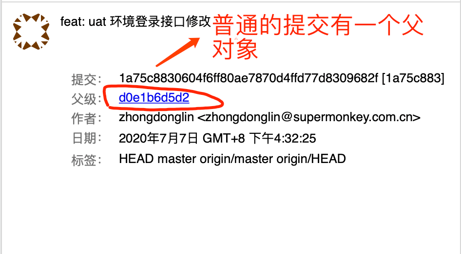

# 深入了解 Git 用法 - 第二周

> 冬林

- 分支介绍
- git checkout --branch
- git merge
- git rebase (包含 git rebase -i)

## Git moji 让每一次提交都充满活力:tada::tada::tada:

[gitmoji 官网](https://gitmoji.carloscuesta.me/)

## 分支基础知识

在进行提交操作时， Git 会保存一个提交对象（commit object）
一个提交信息包含以下内容：
- 作者的姓名和邮箱
- 提交时输入的信息（commit message）
- 指向它的父对象的指针（```首次提交产生的提交对象没有父对象，普通提交操作产生的提交对象有一个父对象， 而由多个分支合并产生的提交对象有多个父对象```）


普通的单次提交


由分支合并的产生提交对象多个父对象


我们假设现在有一个工作目录，里面包含了三个将要被暂存和提交的文件， 目录结构如下：

```bash
project
├── LICENSE
├── test.rb
└── README.md
```
如果我们执行下面的命令：
```bash
$ git add README.md test.rb LICENSE # 步骤 1
$ git commit -m 'The initial commit of my project' # 步骤 2
```
当执行 **步骤 1** 时:
暂存操作会为每一个文件计算校验和（使用 SHA-1 哈希算法），然后会把当前版本的文件快照保存到 Git 仓库中 （Git 使用 blob 对象来保存它们），最终将校验和加入到暂存区域等待提交

当执行 **步骤 2** 时:
用 ```git commit``` 进行提交操作时，Git 会先计算每一个子目录（本例中只有项目根目录）的校验和， 然后在 Git 仓库中这些校验和保存为树对象。随后，Git 便会创建一个提交对象， 它除了包含上面提到的那些信息外，还包含指向这个树对象（项目根目录）的指针。


当有几次提交后，提交对象之间的关系长这样:


> Git 的分支，其实本质上仅仅是指向提交对象的可变指针。 Git 鼓励在工作流程中频繁地使用分支与合并，哪怕一天之内进行许多次。

Note:
> Git 的 master 分支**并不是**一个特殊分支。 它就跟其它分支完全没有区别。 之所以几乎每一个仓库都有 master 分支，是因为 git init 命令默认创建它，并且大多数人都懒得去改动它。


## 分支操作
### 1、创建分支
```bash
$ git branch testing # 创建一个名字为 testing 的分支
```


Git 又是怎么知道当前在哪一个分支上呢？ 也很简单，它有一个名为 HEAD 的特殊指针
因为 ```git branch``` 命令仅仅 创建 一个新分支，并不会自动切换到新分支中去。


#### HEAD 的特性
 - HEAD 指向当前所在的分支
 ```bash
  $ git log --oneline --decorate # git log 命令查看各个分支当前所指的对象
 ```
 
 - HEAD 分支随着提交操作自动向前移动
 - 检出时 HEAD 随之移动
### 2、切换分支
```bash
$ git checkout testing # 这样 HEAD 就 指向 testing 分支了
# 此操作做了两件事情
# 一是使 HEAD 指回 testing 分支
# 二是将工作目录恢复成 testing 分支所指向的快照内容
```
执行 ```git checkout testing``` 之后，HEAD 的指向


> Tips: 创建并且切换到新分支: 通常我们会在创建一个新分支后立即切换过去  ``` git checkout -b branchName```

### 4、删除分支
```bash
$ git branch -d branchName # 删除本地分支，安全操作
$ git branch -D branchName # 强制本地删除分支, !!! 危险操作
```
### 3、合并分支


### 更多分支操作

```bash
# 新建分支：

# 基于当前分支，创建新的分支：

$ git branch <branchName> # 创建新的分支
$ git checkout <branchName> # 切换到 指定分支
$ git checkout -b <branchName> # 创建新分支，并且切换到新的分支

# 基于指定分支，创建新的分支：

$ git checkout -b <branchName> <baseBranchName>

$  git checkout -b dev-test develop  # 基于 develop 分支 创建一个 新的 dev-test 分支，并且切换到这个分支上

# 基于某一次提交，创建新的分支：

$ git branch <branchName>  c6e1e95

查看分支：

$ git branch
$ git branch -r # 查看远程分支
$ git branch -a # 查看所有分支
$ git branch -v  # 如果需要查看每一个分支的最后一次提交
$ git branch --merged # 查看哪些分支已经合并到当前分支
$ git branch --no-merged # 查看哪些分支尚未合并到当前分支
```

## git merge


## git rebase (包含 git rebase -i)

将工作区的变更提交到暂存区

##### 基本用法

```bash
$ git add <path> <path>
$ git add . # 将工作区所有的变动都提交到暂存区
```

#### 参考资料
[Git Commit emoji Guide Git提交注释使用表情指北](https://hooj0.github.io/git-emoji-guide/)