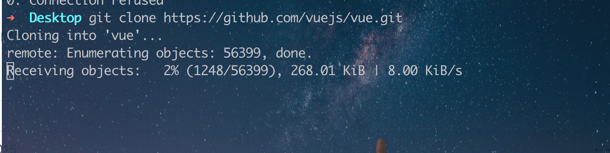
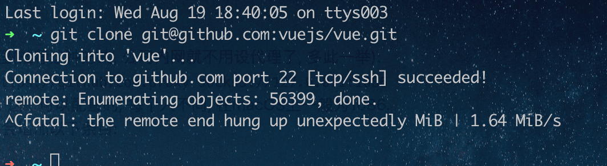

# 深入了解 Git 用法-第五周

> 小英

- git submodule
- git tag
- git hooks
- git test


> 冬林


## git 常见需求与总结

- Git 在工作区不能正常显示中文

```bash
$ git status
"\347\254\254\345\233\233\345\221\250.md" # 文件名的中文不能正确地显示，而是显示为八进制的字符编码
# Git配置变量 core.quotepath 设置为 false, 解决不能显示中文的问题
$ git config --global core.quotepath false
```


## git submodule

当一个模块需要在多个项目中复用时，最简单的方式是复制粘贴，但缺点是实际操作过程中容易忘记在所有项目中同步。此外还可使用 npm 包管理器的方案，但缺点是每当发布后都需要本地更新版本，较为繁琐。于是有了今天要分享的 git submodule - git 里强大的外部依赖管理工具

#### 什么时候使用 git submodule

- 当外部依赖变动非常频繁时，你需要锁定某个指定的 commit 来保证代码的稳定性
- 如果某个组件的更新频率不是很高，并且您希望将其作为外部依赖包进行跟踪
- 当你想要把项目的一部分功能委派给第三方，然后要在指定时间整合在一起，且这种变更不是很频繁时

#### 如何使用

##### 在已有项目里添加子模块

```bash
$ git submodule add https://github.com/xxx/xx

```

#### 缺点

- 在多人协作时，有一定的学习难度
- 升级版本的操作门槛变的很低(git pull)，会导致一不小心就升级了不向后兼容的代码

## git tag

## git hooks

## git test

在进行了五次 git 分享后，相信大家对 git 一定有更深入的了解，接下来会发一个文档来“复习”常见的 git 使用场景

- Git 配置代理

```bash
git config --global https.proxy http://127.0.0.1:1080

git config --global https.proxy https://127.0.0.1:1080

git config --global --unset http.proxy

git config --global --unset https.proxy
```


- Git GPG 签名

Git 虽然是密码级安全的，但它不是万无一失的。 如果你从因特网上的其他人那里拿取工作，并且想要验证提交是不是真正地来自于可信来源.

解决方案就是对于提交和标签 使用 GPG 私钥来签署。

带有 GPG 签名的 ```github``` 提交 看起来会像下面这样：


具体的操作可以看下面的两个链接，目的只是让大家知道有这么一个东西。


### Github 小技巧

#### 1. 加快 ```github 网站```的 ```clone```速度

Github 下载代码的速度也抽风，什么原因大家都知道。

所以，最好的方法就是给 Git 设置代理，但是，我们知道，公司的服务器和国内的一些 Git 服务器商如 码云等，速度本来就正常，无需多此一举，设置代理。所有，我只想要针对 **github** 设置，下面的语法就是只针对 github.com 这个域名设置代理：

Git 目前支持的三种协议 ```git://```、```ssh://``` 和 ```https://```，其代理配置各不相同：```core.gitproxy``` 用于 ```git://``` 协议，```http.proxy``` 用于 ```http://, https://``` 协议，```ssh://``` 协议的代理需要配置 ```ssh``` 的 ```ProxyCommand``` 参数。

下面，我们就举一个 配置 ```http``` 代理的方式来加快 ```git clone``` 仓库的速度:
```bash
# 注意，这个端口(1080)一定要和你本地的代理端口保持一致!, 否则,会导致下面的问题： 
# fatal: unable to access 'https://github.com/vuejs/vue.git/': Failed to connect to 127.0.0.1 port 1086: Connection refused

# 只对 github.com 使用代理
git config --global http.https://github.com.proxy socks5://127.0.0.1:1080
# 取消代理
git config --global --unset http.https://github.com.proxy)
```

实际的效果就是 在 ```~/.gitconfig``` 添加了如下一行：
当然了，你也可以直接打开这个配置文件，手动加入这一行配置。


配置代理前：




设置代理后：速度感觉起飞了，就像开通了百度网盘的会员加速了一样，速度感觉是一个天上一个地下.


#### 注意事项：

- ```socks5``` 配置的代理，针对 使用 ```git clone https://github.com/xxx/xxxxx.git``` 的下载方式有效，对于  ```git clone git@github.com:vuejs/vue.git``` 这种  git 协议下载方式是无效的（即不会走代理）。
- 当 出现 git clone 失败时，记得检查你的代理， 把代理的设置去掉。


如果设置全局代理可能会带来一些问题，也可以在 clone 时使用下面的方式：

🌰：
```bash
# 针对此次 clone, 使用当前配置(设置了代理, 当前配置优先)合并全局的设置
git clone -c http.proxy=socks5://127.0.0.1:1080 https://github.com/vuejs/vue.git
```
亲测有效 👍:apple::apple::apple:


##### PS: 如果想 ssh 访问时， 也走代理，可以做如下配置：

```~/.ssh/config``` 文件, 没有此文件的话就新建一个. 同样仅为 ```github.com``` 设置代理:
macOs 下：

```bash
Host github.com
    User git
    ProxyCommand nc -v -x 127.0.0.1:1080 %h %p # 端口号记得换成你电脑代理的端口
```

Window 下：

````bash
Host github.com
    User git
    ProxyCommand connect -S 127.0.0.1:1080 %h %p # 端口号记得换成你电脑代理的端口
```

这里-S表示使用socks5代理, 如果是```http```代理则为```-H. connect``` 工具 ```git``` 自带, 在 \mingw64\bin\ 下面.

配置成功后，可以测试一下：

测试一下 克隆 ```Vue``` 仓库
```bash
git clone git@github.com:vuejs/vue.git
```



:apple: 速度感人，Nice!

#### 2. 解决 GitHub 图片（用户头像，文档图片加载不出来, 网站访问速度慢的问题）

[GitHub520](https://github.com/521xueweihan/GitHub520)


参考资料：
[Git 设置和取消代理](https://gist.github.com/laispace/666dd7b27e9116faece6)
[使用 GPG 签名你的 Git Commit](https://mogeko.me/2019/065/)
[Git 工具 - 签署工作](https://git-scm.com/book/zh/v2/Git-%E5%B7%A5%E5%85%B7-%E7%AD%BE%E7%BD%B2%E5%B7%A5%E4%BD%9C)
>>>>>>> eacf9058407fdd78e1b33bdb8731a1c358766deb
